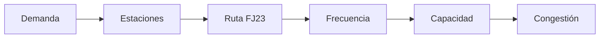

 

  

  

> *Optimizar el transporte es optimizar la vida urbana.*

 

<b>Valeria Colmenares Moreno</b> · 
<b>Miguel Colmenares Rodríguez</b> · 
<b>María Gabriela Martín Avila</b> · 
<b>Sebastián David Moreno Bustos</b>

---

Las estaciones **Las Aguas** y **Museo del Oro** dependen exclusivamente de la ruta **FJ23**, lo que genera un sistema vulnerable ante fallas operativas y picos de demanda.

En horas pico, la demanda supera la capacidad del sistema, generando congestión, aumento en tiempos de espera y saturación del servicio.

---

<i>¿Cuándo la oferta del sistema no alcanza la demanda?</i>

---

| Tipo | Variable | Descripción |
|------|----------|-------------|
| **Principal** | Validaciones | Ingreso de pasajeros |
| **Principal** | Flujo horario | Usuarios por hora |
| **Principal** | Frecuencia | Buses FJ23 |
| **Complementario** | Carril único | Impacto operativo |
| **Complementario** | Regularidad | Consistencia |
| **Complementario** | Factores externos | Condiciones externas |

---

---

Los datos se obtienen desde Datos Abiertos Bogotá y los canales oficiales de TransMilenio, siguiendo una metodología de tres etapas:

| Etapa | Acción | Resultado |
|-------|--------|-----------|
| **1. Recolección** | Datos abiertos y registros | Datos por estación |
| **2. Limpieza** | Depuración | Datos organizados |
| **3. Agrupación** | Clasificación horaria | Patrones |
| **4. Indicador** | Oferta vs demanda | Brecha |
| **5. Diagnóstico** | Identificación de picos | Momentos críticos |

La capacidad de transporte = frecuencia de buses × capacidad por bus. Si capacidad < validaciones → congestión identificada.

---

El entregable final es un tablero interactivo que integra análisis de validaciones, capacidad operativa y patrones de congestión para las estaciones del Eje Ambiental (Troncal J).

| Funcionalidad | Descripción |
|---------------|-------------|
| Validaciones por día | Patrones semanales de demanda |
| Filtro por hora | Demanda desagregada por franja horaria |
| Oferta vs Demanda | Comparación directa del sistema |
| Escenarios | Simulación de mejoras operativas |

### Mapas de calor: Validaciones y Capacidad

Los mapas de calor revelan una **desalineación clara entre demanda y capacidad** en las estaciones Las Aguas y Museo del Oro. Mientras las validaciones muestran picos intensos y recurrentes —especialmente marcados en Museo del Oro—, la frecuencia de buses se mantiene relativamente constante a lo largo del día. Esto provoca que en horas pico la demanda supere la oferta, generando congestión y mayores tiempos de espera.

Lo más relevante es que estos patrones son **predecibles y repetitivos**: el problema no es la falta total de recursos, sino una inadecuada distribución de la capacidad frente a la variabilidad temporal de la demanda.

---

---

El tablero consolida en una sola vista la dinámica completa del sistema: demanda, capacidad y comportamiento temporal. Esta integración permite identificar rápidamente los momentos donde la operación deja de ser eficiente y comienza la congestión.

---

La demanda muestra un comportamiento creciente a lo largo del día, con un incremento sostenido hasta alcanzar su punto máximo en la franja de la tarde. Este patrón no presenta variaciones abruptas, lo que indica que los picos de congestión son altamente predecibles.

---

A diferencia de la demanda, la capacidad operativa no presenta un ajuste dinámico. La frecuencia de buses se mantiene relativamente estable, generando un desfase evidente frente a las necesidades reales del sistema.

---

El cruce entre demanda y capacidad evidencia un desbalance estructural. En múltiples franjas horarias, especialmente en horas pico, la capacidad disponible resulta insuficiente, generando acumulación de pasajeros y aumento en los tiempos de espera.

---

- La congestión no es un evento aislado, es un patrón repetitivo  
- La demanda crece de forma progresiva y predecible  
- La oferta permanece estática frente a cambios en el flujo de usuarios  
- Existe una brecha constante entre capacidad y necesidad operativa  

---

---
