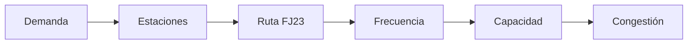

 

  

  

> *Optimizar el transporte es optimizar la vida urbana.*

 

<b>Valeria Colmenares Moreno</b> · 
<b>Miguel Colmenares Rodríguez</b> · 
<b>María Gabriela Martín Avila</b> · 
<b>Sebastián David Moreno Bustos</b>

---

Las estaciones **Las Aguas** y **Museo del Oro** dependen exclusivamente de la ruta **FJ23**, lo que genera un sistema vulnerable ante fallas operativas y picos de demanda.

En horas pico, la demanda supera la capacidad del sistema, generando congestión, aumento en tiempos de espera y saturación del servicio.

---

<i>¿Cuándo la oferta del sistema no alcanza la demanda?</i>

---

| Tipo | Variable | Descripción |
|------|----------|-------------|
| **Principal** | Validaciones | Ingreso de pasajeros |
| **Principal** | Flujo horario | Usuarios por hora |
| **Principal** | Frecuencia | Buses FJ23 |
| **Complementario** | Carril único | Impacto operativo |
| **Complementario** | Regularidad | Consistencia |
| **Complementario** | Factores externos | Condiciones externas |

---

---

Los datos se obtienen desde Datos Abiertos Bogotá y los canales oficiales de TransMilenio, siguiendo una metodología de tres etapas:

| Etapa | Acción | Resultado |
|-------|--------|-----------|
| **1. Recolección** | Datos abiertos y registros | Datos por estación |
| **2. Limpieza** | Depuración | Datos organizados |
| **3. Agrupación** | Clasificación horaria | Patrones |
| **4. Indicador** | Oferta vs demanda | Brecha |
| **5. Diagnóstico** | Identificación de picos | Momentos críticos |

La capacidad de transporte = frecuencia de buses × capacidad por bus. Si capacidad < validaciones → congestión identificada.

---

El entregable final es un tablero interactivo que integra análisis de validaciones, capacidad operativa y patrones de congestión para las estaciones del Eje Ambiental (Troncal J).

| Funcionalidad | Descripción |
|---------------|-------------|
| Validaciones por día | Patrones semanales de demanda |
| Filtro por hora | Demanda desagregada por franja horaria |
| Oferta vs Demanda | Comparación directa del sistema |
| Escenarios | Simulación de mejoras operativas |

### 🔥 Mapas de calor: Validaciones y Capacidad

Los mapas de calor revelan una **desalineación clara entre demanda y capacidad** en las estaciones Las Aguas y Museo del Oro. Mientras las validaciones muestran picos intensos y recurrentes —especialmente marcados en Museo del Oro—, la frecuencia de buses se mantiene relativamente constante a lo largo del día. Esto provoca que en horas pico la demanda supere la oferta, generando congestión y mayores tiempos de espera.

Lo más relevante es que estos patrones son **predecibles y repetitivos**: el problema no es la falta total de recursos, sino una inadecuada distribución de la capacidad frente a la variabilidad temporal de la demanda.

---

### 📊 Dashboard: Visualización de Afluencia y Eficiencia

El dashboard consolida los hallazgos en visualizaciones accionables. Las principales conclusiones son:

- **65% de suficiencia operativa:** Solo 6 de cada 10 horas del día presentan capacidad suficiente para atender la demanda. El 35% restante corresponde a franjas donde el sistema opera por debajo de lo necesario.

- **Pico crítico entre las 4:00 p.m. y las 6:00 p.m.:** El gráfico de validaciones por hora evidencia que la demanda escala hasta ~700 usuarios/hora en este intervalo, mientras que la capacidad disponible no crece proporcionalmente, generando el mayor punto de congestión del día.

- **Capacidad irregular a lo largo del día:** El gráfico de capacidad por hora muestra una oferta que oscila entre 500 y 680 unidades sin un patrón que responda a los picos de demanda conocidos, lo que confirma que la programación de frecuencias no está alineada con el comportamiento real de los usuarios.

- **Días con mayor presión:** El 4 de marzo de 2026 registró el mayor volumen de validaciones del período analizado (21,8 mil en un solo día), con una demanda diaria que supera los 25.000 usuarios en varios días de la semana, poniendo en evidencia la necesidad de reforzar la oferta en días hábiles.

- **Brecha sistémica, no puntual:** La comparación entre validaciones y capacidad diaria muestra que el desajuste no es un evento aislado, sino una condición estructural del servicio en este tramo de la Troncal J.

---

 

